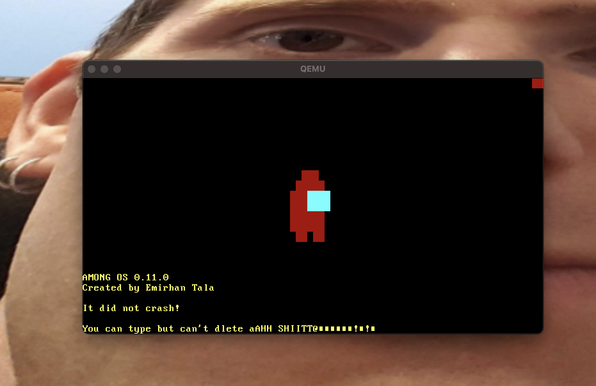

#  AmongOS

A small sussy operating system written with the Rust programming language. Developed by following Philipp Oppermann's [Writing an OS in Rust](https://os.phil-opp.com/) blog.


## Screenshots




## Roadmap

| Status |       Feature        |
|:------:|:--------------------:|
|   ✅    |      Bare Bones      |
|   ✅    | Amogus On The Screen |
|   ✅    |    VGA Text Mode     |
|   ✅    |       Testing        |
|   ✅    |      Interrupts      |
|   ✅    |  Memory Management   |
|   ⏳    |     Multitasking     |
|  ...   |         ...          |

## Installation

You can't just download and run the operating system, unfortunately.

To proceed, it is necessary to install QEMU and Rust Nightly. You might also need to follow some extra steps, so I suggest referring to the first two tutorials on [Writing an OS in Rust Philipp Oppermann's blog](https://os.phil-opp.com/)

[AmongOS's crates.io page](https://crates.io/crates/amongos)

## Usage 

To build:

```shell
cargo build --target among.json
```

To run on Qemu

```shell
qemu-system-x86_64 -drive format=raw,file=target/among/debug/bootimage-amongos.bin
```

## Acknowledgements

- [Writing an OS in Rust Philipp Oppermann's blog](https://os.phil-opp.com/)
- [blog_os repo](https://github.com/phil-opp/blog_os)
